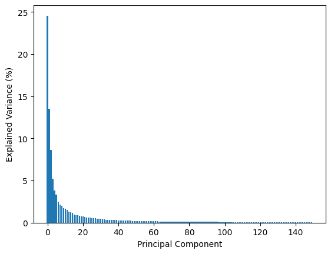

# eigenfaces-face-recognition
Face recognition using Eigenfaces and Principal Component Analysis (PCA).
## Overview
This project applies the Eigenfaces method for face recognition using PCA. The goal is to reduce the dimensionality of face images while preserving the most important facial features for classification.
The workflow includes:
- Loading the Olivetti faces dataset
- Preprocessing face images
- Applying PCA for feature extraction
- Visualizing the average face
- Analyzing explained variance
- Evaluating classification performance

## Technologies Used
- Python
- Jupyter Notebook
- NumPy
- scikit-learn
- Matplotlib
- PCA
- Machine Learning

## Files
- `notebooks/olivetti.ipynb`
- `data/olivetti.mat`
- `results/eigenfaces_visualization.png`
- `results/explained_variance_analysis.png`
- `results/average_face.png`
- `results/pca_explained_variance_plot.png`
- `results/confusion_matrix.png`

## Dataset
This project uses the Olivetti Faces dataset provided by A&T Laboratories Cambridge and available through scikit-learn.
[Olivetti Faces Dataset](https://scikit-learn.org/0.19/datasets/olivetti_faces.html).

## Results
### Eigenfaces Visualization

### Average Face

### Explained Variance Analysis

### Confusion Matrix

## Methodology
PCA was applied to extract the most important components from the face images. These principal components, represent the dominant patterns in the dataset and allow dimensionality reduction before classification.
The model performance was evaluated using a confusion matrix and classification metrics.

## Applications
This project can be applied in:
- Face recognition
- Pattern recognition
- Computer vision
- Dimensionality reduction
- Machine learning

## Author
Marina Kotsiopoulou
