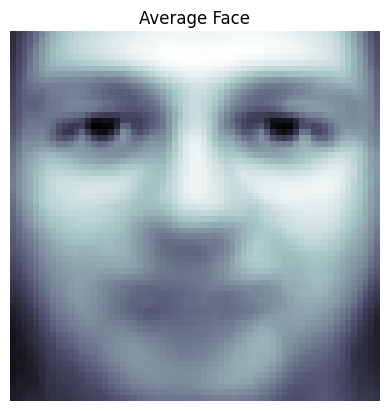
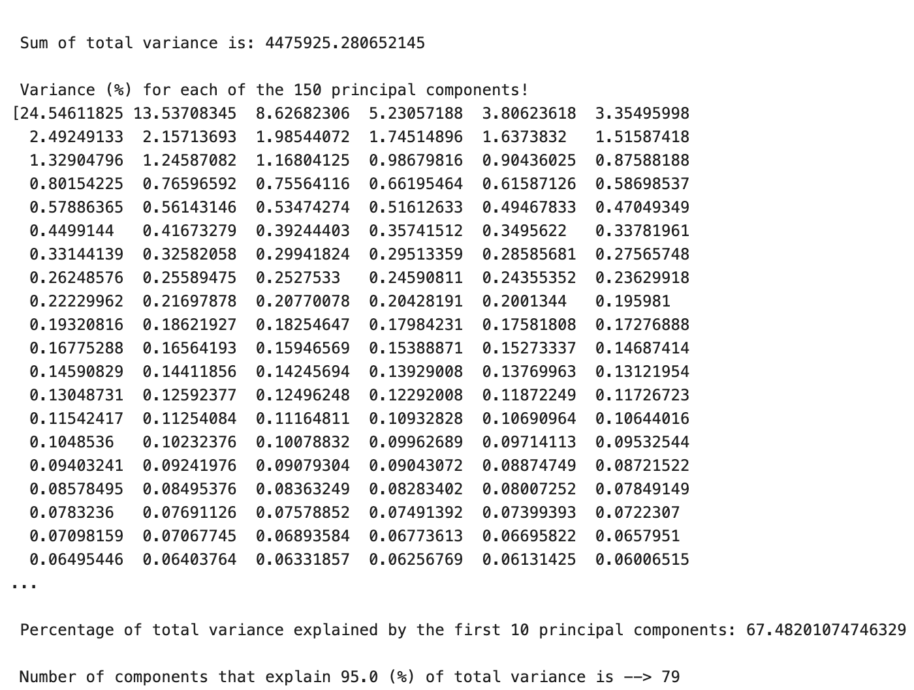
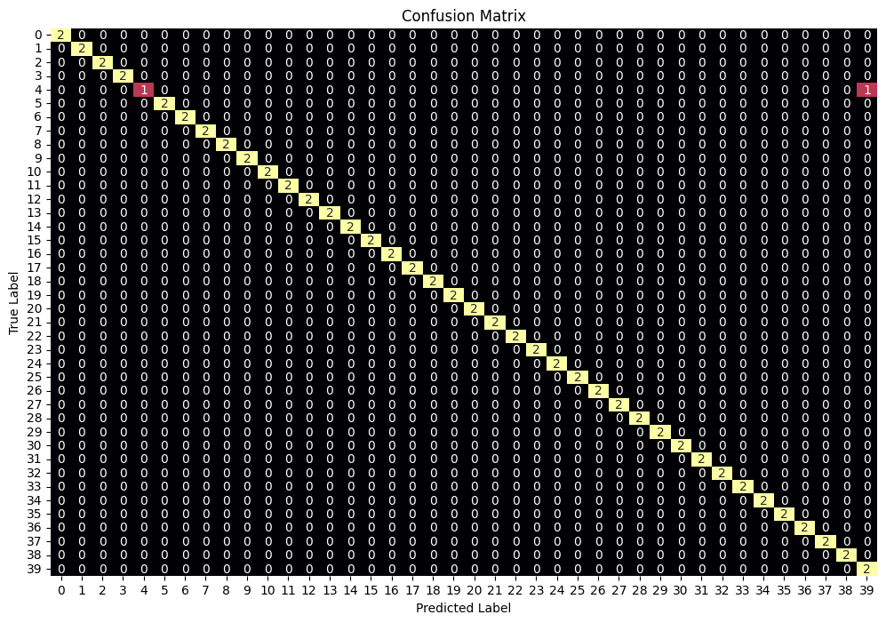

# Eigenfaces Face Recognition
## Project Overview
This project implements a face recognition workflow using the Eigenfaces method and Principal Component Analysis (PCA). The objective is to reduce the dimensionality of facial images while preserving the most discriminative information for face recognition. The project demonstrates core concepts in computer vision, dimensionality reduction, feature extraction, and machine learning-based recognition.

---

## Methodology
The workflow includes:
1. Loading the Olivetti faces dataset
2. Preprocessing face images
3. Computing the average face
4. Applying PCA for dimensionality reduction
5. Extracting eigenfaces as principal visual components
6. Training and evaluating a face recognition classifier on PCA-transformed features
7. Evaluating recognition performance using a confusion matrix

---

## Sample Results
The following examples illustrates the complete Eigenfaces workflow, from facial image preprocessing and principal component extraction to classification performance evaluation.
### Eigenfaces Visualization
The eigenfaces represent the main patterns of variation across the facial image dataset.

### Average Face
The average face summarizes the common facial structure across the dataset.

### Explained Variance Analysis
The explained variance plot shows how much information is retained by the selected principal components.

### Confusion Matrix
The confusion matrix provides a visual overview of the model's classification performance.

---

## Technologies Used
- Python
- NumPy
- scikit-learn
- Matplotlib
- Jupyter Notebook
- Principal Component Analysis (PCA)
- Machine Learning

---

## Dataset
This project uses the Olivetti Faces dataset, available through scikit-learn.
[Olivetti Faces Dataset](https://scikit-learn.org/0.19/datasets/olivetti_faces.html).
